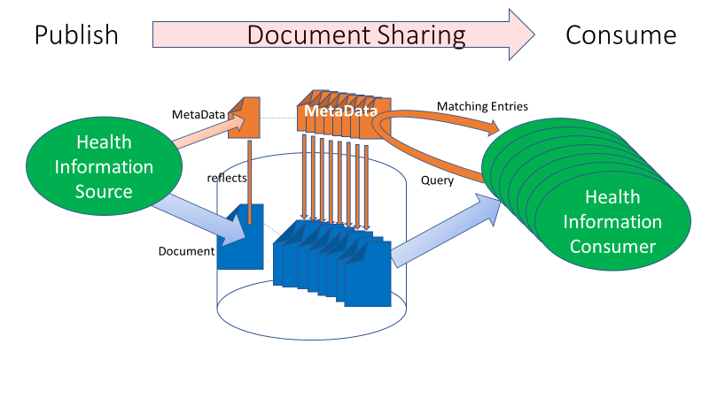
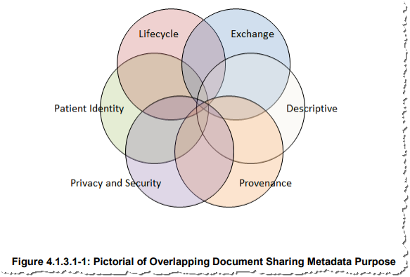
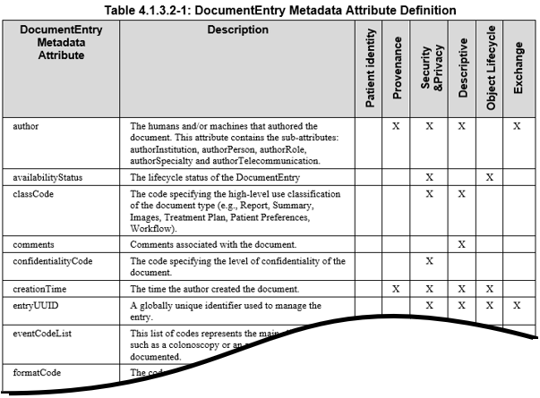

**Integrating the Healthcare Enterprise**

**[IHE IT Infrastructure](https://profiles.ihe.net/ITI)** **Handbook**

**Document Sharing Metadata**

**Revision 1.1 - Published**

Date: August 20, 2018

Author: ITI Technical Committee

Email: ititech@ihe.net
# Foreword
This is a handbook of the IHE IT Infrastructure Domain.

This handbook is published on August 20, 2018. Comments are invited and can be submitted to [IHE ITI](http://ihe.net/ITI_Public_Comments/).

General information about IHE can be found at [www.ihe.net](http://www.ihe.net/).

Information about the IHE IT Infrastructure domain can be found at [ihe.net/IHE\_Domains](http://ihe.net/IHE_Domains/).

Information about the organization of IHE Technical Frameworks and Supplements and the process used to create them can be found at [http://ihe.net/IHE\_Process](http://ihe.net/IHE_Process/) and [http://ihe.net/Profiles](http://ihe.net/Profiles/).

The current version of the IHE IT Infrastructure Technical Framework can be found [online](https://profiles.ihe.net/ITI/TF/index.html).

**CONTENTS**
* [Introduction](#1-introducion)
* [Principles of good document metadata control](#2-principles-of-good-document-metadata-control)
* [Process to define your document metadata constraints](#3-process-to-define-your-document-metadata-constraints)
* [Metadata principles and guidelines](#4-metadata-principles-and-guidelines)
* [Glossary](#glossary)
# 1 Introduction
The Document Sharing profiles from IHE including [XDS](https://profiles.ihe.net/ITI/TF/Volume1/ch-10.html) and [XCA](https://profiles.ihe.net/ITI/TF/Volume1/ch-18.html), enable a Community to share Patient specific medical documents. This is described in the [Enabling Document Sharing through IHE Profiles white paper (HIE using IHE)](https://profiles.ihe.net/ITI/HIE-Whitepaper/index.html). Each document shared is described by metadata. A Community deploying an HIE (Health Information Exchange) this way needs to define some metadata constraints and practices, so that the documents are found when they are needed. This handbook helps a Community to come up with appropriate constraints.
## 1.1 Purpose of this Handbook
This handbook is intended to assist the reader on the steps necessary to define how document metadata would be used, how to enforce and propagate that use, and how to evolve the document metadata use constraints over time. Use of this handbook will produce a set of documentation and plans that we call your “Community Metadata Specification”. A well-managed Community Metadata Specification is an essential component of an efficient and coordinated Document Sharing system. This becomes more important with increase in participation, the number of patients, document types, and shared documents.

This handbook uses the term “Community” as defined in the [Enabling Document Sharing through IHE Profiles white paper (HIE using IHE)](https://profiles.ihe.net/ITI/HIE-Whitepaper/index.html). This definition is inclusive of an XDS Affinity Domain, an XCA Community, or a set of XCA Communities. This definition is also inclusive of the use of MHD (XDS-on-FHIR), although further discussion of MHD is not explicitly included in this handbook.

This handbook constrains document metadata to enable optimal discoverability of the shared documents within your Community. There are other responsibilities of Community management: patient identity and demographics management, organizational identification and credentialing, privacy policy, security policy, partner certification processes, etc. IHE addresses these broader topics in other publications listed in [Background References](#background-references), including the whitepaper ["Template for XDS Affinity Domain Deployment Planning”](http://www.ihe.net/Technical_Framework/upload/IHE_ITI_White_Paper_XDS_Affinity_Domain_Template_TI_2008-12-02.pdf).
### 1.1.1 When to use this Handbook
This handbook is intended to be used in various situations.
* When initially deploying a Community – In this case there are no existing documents published, so the opportunity is to define the expected use of the metadata.
* When adding a new document use case to a Community – Any new use cases may drive changes to the Metadata use
* When connecting new partners to a Community
* When connecting multiple Communities together – This will focus on harmonizing the various Community Metadata Specification
* On a regular basis (roughly between 2-5 years), to re-examine past use case analysis and decisions – this focuses on how the environment or user base has changed.
### 1.1.2 How to use this Handbook
This handbook is designed to guide you to an understanding of your intended use cases and technology limitations of metadata within various scales of Document Sharing Communities. The handbook recommends that a team of stakeholders in your Community follow a process that considers your needs, makes decisions, documents them, and creates a plan for deploying those decisions. This handbook is intended to scale from a single purpose XDS Affinity Domain such as a research project, to a regional Health Information Exchange using XDS, or to a set of federated Communities using XCA.
## 1.2 Intended Audience
The intended audience of this handbook is:
* Those involved in deployment of an XDS Affinity Domain, or XCA Community;
* Those involved in joining multiple Communities using XCA;
* Clinicians involved in the use of documents from the Communities;and
* Developers involved in implementing actors supporting the Community.

The intended audience is expected to be well versed in the Document
Sharing metadata concept, vocabulary use, and understand the intended
use cases for their Community.
## 1.3 Background References
The following references are considered critical foundational text that should be understood by those participating in the use of this handbook (all links can be found [here](https://wiki.ihe.net/index.php/Metadata_Handbook)).
* [HIE using IHE Profiles](https://profiles.ihe.net/ITI/HIE-Whitepaper/index.html) – defines the basics of Document Sharing and the use of the IHE profiles,
* [Section 4 of Volume 3 of IHE ITI Technical  Framework](https://profiles.ihe.net/ITI/TF/Volume3/index.html#4) – defines the XDS and XCA metadata,
* [Template for XDS Affinity Domain Deployment    Planning](http://www.ihe.net/Technical_Framework/upload/IHE_ITI_White_Paper_XDS_Affinity_Domain_Template_TI_2008-12-02.pdf) - White Paper covering the broader process and policy recommendation for deploying an XDS Affinity Domain,
* [Basics of doing Document Sharing Query     right](https://healthcaresecprivacy.blogspot.com/2018/04/basics-of-doing-document-sharing-query.html) – blog article that explains use of critical few query parameters  and using further processing of the resulting document entries to avoid false-positive and false-negative results,
* ALL IHE defined profiles in the [Document Sharing family](http://wiki.ihe.net/index.php/Category:DocShare) (e.g., XDS, XCA, MHD, etc.),
* All IHE defined profiles of [CDA](http://wiki.ihe.net/index.php/Category:CDA)®1,
* [European metadata    project](https://ihe-europe.net/sites/default/files/2017-11/IHE_ITI_XDS_Metadata_Guidelines_v1.0.pdf) - initiative to collect and analyze XDS metadata initiatives in 10 European countries and general introduction to categorization topics, 2017,
* Example of a [classCode value set](http://wiki.ihe.net/index.php/XDS_classCode_Metadata_Coding_System)
### 1.3.1 Samples and ongoing Discussion
IHE has gathered metadata value sets from various projects. IHE has started a discussion forum to encourage sharing by the community of individuals working on Metadata use and constraints. These and other examples can be found on the [IHE wiki](https://wiki.ihe.net/index.php/Metadata_Handbook) A discussion forum has also been setup in [Google groups](https://groups.google.com/forum/%23!forum/ihe-metadata).
## 1.4 Comment Process
IHE International welcomes comments on this document and the IHE initiative. They can be submitted by sending an email to the co-chairs and secretary of the ITI domain committees at ITI@ihe.net. A Community forum of peers also using this handbook is available at <ihe-metadata@googlegroups.com>
## 1.5 Open and Closed Issues

### Open issues:
* none
### Closed issues:
* **MDH-4**: We recognize authorInstitution and sourcePatientInfo are constrained by various projects for specific uses. Such as use of authorInstitution use being consistent with the XUA SAML assertion   content, and sourcePatientInfo use being consistent with national patient ID assigned. These are useful constraints within those projects, but it is not clear to what extent they are globally defined Best Practices that his handbook could recommend.
* **MDH-5**: typeCode is a value selected by the publisher of a document, expressing its intention for the document. The value set within a Community for typeCode will have to be comprehensive and is likely to contain overlapping codes. There can be preferred use codes within a Community and guidance to reduce overlap. But, in the end, it will be the publisher of a document that choose the best code from their perspective. This is a reality of clinical practice that the publisher must be allowed to pick the typeCode that best expresses their intentions for the document.
* **MDH-6**: classCode is a value intended to assure discoverability success. The classCode should come from a small value set of non-overlapping codes. Ensuring non-overlaps delivers the certainty that no clinically relevant document may be missed.
* **MDH-7**: Historic metadata is unlikely to be changeable, given the challenged in semantic mapping, so the old vocabulary is most likely to remain visible and valid. There are methods, such as Metadata Update, to revise metadata; however, these methods are discouraged as their use for this purpose becomes very expensive as the longitudinal data grows. Therefore, one must always accept that historic data may not be following current metadata expectation. This means that when looking for document within a time span that  covers different metadata definition regimes one may have to query two different ways or be more liberal in the query expectations. This also means that having to redesign/adjust a Community Metadata    Specification for metadata should be avoided, by adopting a forward-looking approach from the beginning.
* **MDH-8**: This handbook did not include discussion or impact of IHE profiles leveraging FHIR®2. 
# 2 Principles of good document metadata control
The overall use case for Document Sharing makes metadata critical to data discovery. The *Document Source* must carefully use the right metadata to describe the document. The quality and accuracy of the metadata produced by the Document Source is critical to any reliable and efficient access to shared documents. The *Document Consumer* must leverage the Query model, and the resulting list of available files must answer the expectations of the end users. If a Document Source “misfiles” a record (incorrect creation of metadata), the record may not be found by the Document Consumer. To avoid these potential hazards, the following measures must be considered:
* Any Document Consumer within the Document Sharing Community should be able to accurately interpret the correct meaning of the metadata;
* Harmonization of metadata sets is needed when multiple Affinity Domains want to exchange documents, either through common metadata sets or through mapping;
* Metadata attributes and value set attributes should be clearly defined to ensure that sources can publish content accurately;
* A guideline and ‘decision tree’ are very useful to ensure the correct use of the metadata for entry and retrieval of documents. Disambiguation between semi-overlapping values should be explained and linked to a decision tree.

**Figure Document Sharing Lifecycle**

The XDS/XCA Query transaction has several query capabilities. The FindDocuments query is one of the most powerful.
The other  queries are not useless but are for more special purposes. Some are more focused on SubmissionSets, Folders, and Associations. These may be useful for specific use cases, but not for a general-purpose Document Consumer.
## 2.1 XDS/XCA Optimal Query
The FindDocuments query has 17 query parameters, but 7 of them play a critical role. These parameters are the “critical few”, especially for the initial query that performs the *primary filtering* (further discussed in [Various uses for metadata](#34-various-uses-for-metadata) among all available documents for a patient that may be in the thousands with a mature deployment. This primary filtering optimizes the use of query to return the best possible results, avoiding missing any results that should be considered. This favors false-positives (results that are not desired), over false-negatives (missed results). The query results returned include full metadata for each entry found; *local refinement* of these results (see [Section 2.2](#22-local-refinement-of-query-results)) is used to further eliminate these false-positives.
The other 12 parameters may also be used, but the effectiveness of these additional parameters in primary filtering is limited. See [Section 2.1.2](#212-power-of-other-query-parameters) for further explanation. Here are the 7 query parameters and metadata attributes that are combined for primary filtering:
* **patientId** - this is required in XDS/XCA. You must have a Patient ID you are interested in. Use of PIX, PDQ, XCPD, or some other Patient Identity Management system is a prerequisite, that will not be further discussed in this handbook.
* **classCode** – classCode is used to group documents into logical classes which are useful to primary filtering success. A small number of controlled value set of pre-negotiated code values should be defined to group documents into broad logical 'classifications',designed so that for any use case where someone is looking for documents they can pick one term from this value set.
* **practiceSettingCode** - this is the clinical specialty where the act that resulted in the document was performed. Like the classCode, this should have been filled with a controlled value set of   pre-negotiated code values that represents broad classifications of clinical specialties. By restricting the value set to the high-level clinical specialties, one should avoid the misfiling associated with     documents produced by sub-specialties.
* **serviceStartTime** - **serviceStopTime** – When there is a timerange of the service event that you are interested, you will query against the serviceStartTime and service StopTime metadata element to find documents that indicate they fit your timerange. The service times are specific to the time range of the treatment or episode. This is different than the document creation time, which is when the document was created. The query results will return any document whose “service time” falls within that range. It is    important to note that these parameters work together to give a  period of time.
 Given you are interested in a specific time range (**Start** -\>
**Stop**).
	* The serviceStartTimeFrom and serviceStopTimeTo are clear they should bound that time with a little extra time to deal with poor timeclocks:
		* serviceStartTimeFrom parameter in the query should be set to a few minutes before the time you are interested in being the **Start** of the service time range
		* serviceStopTimeTo parameter in the query should be a set to a few minutes after the time you are interested in being in the **Stop** of the service time range
	* Some DocumentEntries will have a service start time but not have a service stop time. This is common in chronic care, radiology, and other circumstances where the end of the service has not happened or  where the end is unknowable, therefore you should include a query parameter that would eliminate DocumentEntries that have a declared start time well after the time range you are interested in:
		* serviceStartTimeTo parameter in the query should be set to a few minutes before the time you are interested in being the **Stop** of the service time range
	* Some DocumentEntries will have a service stop time but not a service start time. This is not common, but will happen where there is no clear start time to an observation, therefore you should include a query parameter that would eliminate DocumentEntries that have a declared stop time well before the time range you are interested in:
		* serviceStopTimeFrom parameter in the query should be set to a few minutes after the time you are interested in being the **Start** of the service time range
	* Some DocumentEntries will have neither service start or stop. These will be returned regardless of any timeframe query parameters. Your Community Metadata Specification should encourage all metadata    publications populate the serviceStartTime and serviceStopTime element as much as possible to avoid false-positive query results.
### 2.1.1 Classification – value sets are critical
The above optimal query shows that two of the critical FindDocuments query parameters (classCode and practiceSettingCode) should come from well controlled value sets, each having a limited number of code values that represent broad classifications.
These codes need to be useful and recognizable for the end users. They expect to find documents under a certain ‘heading’ or category. The more values a value set has, the harder it is to store and retrieve the document under the right category.
So, how does a Community determine what these value sets should contain? That is the main topic of this document.
### 2.1.2 Power of other query parameters
The critical few query parameters support the most common queries and have the necessary robustness to perform a primary query filtering among all documents available for that patient. They return a list of matching document entries, with little or no risks of missing potentially relevant documents. Additional parameters could be considered, but have some inherent weaknesses:
* **typeCode** is a value selected by the publisher of a document, expressing its intention for the document (see [Table: Codable Metadata Attributes](#table-codable-metadata-attributes)). The value set within a Community for typeCode will have to be comprehensive and is likely to contain overlapping codes. There can be preferred use codes within a Community and guidance to reduce overlap. But, in the end, it will be the publisher of a document that chooses the best code from their perspective. The reality of    clinical practice is that the publisher must be allowed to pick the typeCode that best expresses their intentions for the document. Any overlap between code values (e.g., neuropediatric report code versus    pediatric report code), would result in missing some report if the later code is used.
* **availabilityStatus** opens access to documents that have been replaced with newer versions to address special cases (e.g., investigate potential clinical errors).
* **formatCode** specifies the technical format of the document. It is a further specialization more detailed than the mime-type. The formatCode provides sufficient information to allow any potential    document consumer to know if it can process and/or display by identifying a document encoding, structure and template. This is a technical descriptive parameter that is unlikely to be used and understood by a clinician.
* **authorSpecialty** specifies precisely the specialty of the author of the content of a document. It may be as precise as the author wishes to represent the specialty, sub-specialty, and further skill the author deems meaningful. Therefore, such authorSpecialty codes are likely to contain overlapping codes, thus resulting in missing some relevant documents if the consumer does not think of using all possible overlapping values.
* **healthCareFacilityType** code may be useful in specific situations where a patient remembers the type of facility he was recently treated at, but not the specific name or address. In these rare  cases this parameter may be useful to perform a primary query.
* **eventCodeList** provides the ability to extend the metadata parameters to support queries of documents that contain specialized data (e.g., imaging procedure code for imaging reports or imaging studies). It would indeed be useful to complement the critical few parameters in a primary query with an event code. It is important that an event code be defined for specific values of classCode, PracticeSettingType, or combination of these parameters (e.g., an imaging procedure code is used for document that have the    practiceSetting value “Radiology” combined with a classCode value “Report” or “Images”).
* **creationTime** provides the ability to define a range of times between which the documents of interest have been created. The creationTime may be very different than the serviceTime (e.g., a discharge summary was created a week after the patient was actually discharged because some reports have not been approved or laboratory diagnosis test completed). Such a parameter may be useful to perform incremental queries (new document entries created since the last query was performed).
## 2.2 Local refinement of Query results
The above critical few query parameters are necessary, but not always sufficient. The above query will result in false-positive results, that can be eliminated by local processing of the resulting metadata.
A Document Consumer must be ready to do some form of local processing. This local processing would leverage all of the metadata. It might further eliminate unnecessary entries, group and sort the results, put emphasis on some entries, show relationships between documents et cetera. This local processing might be an automated algorithm and/or the possibility to interactively change the order, look for search words, by the end users.
Local processing is necessary for time range, as any DocumentEntry that has not specified a value for service time will be returned.
Even after local processing of the metadata from the results of the query to further eliminate the false-positives, one might still have more than one potential document of interest. In this case the document content will need to be retrieved and further processed.
## 2.3 Lessons learned by this query strategy
The above optimal query strategy paired with local processing of thequery results to further refine is designed to get best results, that have no false-negatives and minimize the false-positives that would frustrate user.
There has been experimentation of adding extra metadata to provide morerefined query results. However, these approaches will expose more sensitive information in the Metadata. Therefore, this handbook discourages the use of extra metadata.
There has been experimentation with using other query parameters, as discussed in [Section 2.1.2](#212-power-of-other-query-parameters), these cases exist but are very specific.
Experience with Document Sharing has also made clearer that documententries over time will continue to be described as they were recorded atthe time of publication. These historic documents are still relevant for specific use-cases. The use-cases where historic documents are desired must be very robust to the historic document entries.
# 3 Process to define your document metadata constraints
In this section, the process steps of the definition of your XDS metadata set are described and tips are provided. Manage this process as a project, including all stakeholders from the beginning. The following steps will be explained:
1.  Identify shared business needs;
2.  Gather relevant use cases;
3.  Gather existing patterns of how metadata are used;
4.  Consider the various uses for metadata in the relevant use cases:
5.  Determine the needs for constraints;
6.  Assemble the metadata attributes;
7.  Use the guidance to assemble the metadata constraints and value sets;
8.  Record all decisions and actions into your Community Metadata Specification;
9.  Promulgate and deploy your Community Metadata Specification; and 
10. Plan to revise your Community Metadata Specification in the future    
## 3.1 Identify shared business needs
Collaborating parties and stakeholders in a Community must agree on the
need for a shared definition and implementation of a metadata set. Here
are the steps to organize this:
* Set up a project and working group to organize the processes: Make sure you involve all relevant stakeholders as possible from the beginning, such as: policy makers, organization management, information architects and analysts, end users (‘Sources’ and ’Consumers’),  administrative personnel, database- and network engineers, EHR-, HIT-, and Document Source vendors, competence centers, SDOs, professional societies, et cetera.
* Define what the business cases are that bring the Community together: This depends on the scale of the Community. Define and write down the relevant use cases that drive the current business, analyze common requirements and start with these to delineate the scope of the business case. If you begin with sharing only cardiology images, start with those, but keep in mind that the business needs will grow in time and think ahead.
* Achieve agreements: organization, legal, financial, governance: Signed agreements are conducive to a well-organized, cooperative and consistent Community.
* Set groundwork for deployment and maintenance: Plan the implementation the metadata, including the vendors of Document Sources, vendors (XDS, EHR, HIT, and integration brokers),end users (teaching), healthcare organizations and other parties.
* Engage with regulators, and professional societies: Engaging early with regulators and professional societies will identify requirements that must be met, and best practices that others have available for use.
## 3.2 Gather relevant Use cases
Make an inventory of the current and planned use cases in the Community and look at use cases in other Communities. Look at what types of documents are used in these use cases, such as:
* Medical
	* Referral letters
	* Intake reports
	* Medication information
	* History & physical reports
	* Consultation documentation
	* Laboratory results
	* Genomics, biomics, proteomics information
	* Diagnostic test reports
	* Multidisciplinary board reports
	* Discharge letters
	* Encounter Summaries
	* Patient Summaries
	* Surveys/Assessments
	* Advance directives
	* Notes
* Workflow related
	* Referrals
	* Care plans
	* Appointments
	* Diagnostic study requests
	* Timelines
* Registrations
	* Quality registrations
	* Outcome measurements
	* Research studies
* Administrative
	* Demographics
	* Legal
	* Insurance / financial
	* Consents
* Multimedia and Images
	* Imaging studies
	* Medical photographs and movies
	* Microscopy / pathology studies
	* Audio and video

From these use cases, end user- and technical requirements can be set up for the metadata set. Consult with all stakeholders to get a clear view of the expectations of the end users towards the categories choices.
As you consider the current and planned use cases in your Community, assume that additional use cases, not necessarily identified yet, will emerge and will have to be supported. For this, it is wise to plan that additional types of documents to be shared, documents that will likely be added in the future. Defining from the start the metadata capabilities to represent those future use cases is a wise forward planning (see the challenges in [Section 4](#4-metadata-principles-and-guidelines) to evolve a Community Metadata Specification). We recommend, based on the IHE Community experience, to include among the above document types, some of the document types that are most often deployed across the world: referral letters, medication information, laboratory results, diagnosis test reports, referral, care plans, diagnosis study requests, imaging studies, and consents.
## 3.3 Gather existing patterns of how metadata are used 
Within an existing Community there will be patterns of use. These historic patterns should be documented as they would be considered as part of the creation of your new Community Metadata Specification. These may have grown organically or follow some existing governance.
For each type of document currently published, identify the various metadata codes that are used. Capture the current way that XDS queries are done. Note that historic and current use of metadata might have deviated from your current Community Metadata Specification. This is an indication that there is an unmet need, or a misunderstanding of your existing Community Metadata Specification. These deviations should be investigated carefully to guide the updated Community Metadata Specification.
## 3.4 Various uses for metadata
In this section we will guide you on some best practices, to help guide you at making your new decisions on how metadata will be used in your Community. Consider the various uses for metadata in the relevant use cases:
* Define the use of the metadata for the most relevant “critical few” used in queries – as discussed previously in [XDS/XCA Optimal Query](#xdsxca-optimal-query);
* Define the use of the metadata for the additional metadata that are used in local filtering – as discussed in [Local refinement of Query results](#local-refinement-of-query-results);
* Define the use of the metadata for the remaining attributes that are “less critical” (e.g., used in less common processing of the returned query response, or by human review of the metadata).

Note: The above figure is from [IHE ITI Technical Framework Volume 3](https://profiles.ihe.net/ITI/TF/Volume3/ch-4.1.html#4.1.3).

The IHE ITI Technical Framework Volume 3 contains details on each metadata attribute, and the various use cases that each assist with. The following snippet from “Table 4.1.3.2-1” is from tables found in the
[ITI Technical Framework Volume 3.](https://profiles.ihe.net/ITI/TF/Volume3/index.html#4) The reader needs to be very familiar with the definitions of the metadata found in ITI Technical Framework Volume 3.

The XDS metadata attributes cover a number of domains that focus on a number of axes: patient identity, privacy and security, provenance(authors, senders, location, date and time), processes, purpose (descriptive), document lifecycle information and technical information about the document itself. The why, where, what, when, how and other metadata aspects document the context within which the document was created. This information is vital for the correct interpretation of the information contained in the document. All these metadata attributes can be used, often in combination, for the filtering and selecting of specific information types.
The main purposes for metadata are:
* Documenting
	* All metadata attributes define the contextual information about the document (why, what, when, who, …). They are vital for the correct interpretation of the information contained in the document;
* Filtering
	* As discussed in [Principles of good document metadata control](principles-of-good-document-metadata-control), but also including all other queries and metadata use documented in the IHE Technical Framework
* Grouping
	* There are mechanisms to support groups of documents including SubmissionSets, Folders, Associations, and ReferenceIdList that can be used to make a persistent record of a group certain documents that belong together. Each of these has different advantages and disadvantages. They are not further elaborated in this handbook.
	* Categorization attributes can also be used for grouping documents of a certain type, for instance letters, notes, summaries et cetera. Grouping is a specific form of filtering based on metadata with the purpose of creating groups of certain types of documents. In many EHR user interfaces, tabs are used to quickly find the right type of document or image, and grouping is used to place the right documents under the right tabs.
* Sorting
	* Category attributes have predefined value sets. The captions of these value sets can be shown in alphabetic order, or in another predefined order (for instance, showing the most frequently used     options first);
	* Linking of coded value set attributes to terminologies allows for additional descriptions for sorting and finding documents and images, even in other languages. Attributes that have coded lists as     options to choose from can also be sorted in different ways by linking the codes to different captions, so that end users can choose the caption list that they are accustomed to;
	* End-users should be able to interactively sort on different kinds of parameters (date, specialty, functional type, author, department, et cetera).

Filtering, grouping and sorting the available documents greatly enhance the discoverability of specific documents. Setting up a recognizable and intuitive set of metadata attributes helps the end users in quickly accessing the right information at the right time for the right purpose.

## 3.5 Determine the needs for constraints

Each Community will determine the desired level of constraints. Some Communities may only define a specific value set for classCode and leave all other metadata with the default constraints from XCA or XDS; other Communities will need to define constraints for every metadata attribute across all object types.

* Where there are rules already in place in a Community, determine how well these are working and what the gaps are.
* Where multiple Communities are federated with XCA, the differences between the metadata sets of these Communities will need to be harmonized, or mapped. Much of the time the harmonization and mapping are  incomplete thus the consuming human may need to be able to work with poor search results.
* The technology used within the Community may have technical constraints. For example, a publishing system that has fixed codes that can’t be changed. These technical constraints are unfortunate but are a reality. It is better to understand them, and work around them.
* IHE has predefined the use of metadata attributes and value sets for some document types:

#### Table: Sample of IHE Document Content Profiles – with metadata constraints

| IHE Domain | Profile Acronym | IHE Profile Links                                                                                                                      |
| ---------- | --------------- | -------------------------------------------------------------------------------------------------------------------------------------- |
| ITI        | XDW             | [Cross-Enterprise Document Workflow](http://wiki.ihe.net/index.php/Cross_Enterprise_Workflow)                                          |
| ITI        | XDS-SD          | [Cross-enterprise Sharing of Scanned Documents](http://wiki.ihe.net/index.php/Cross-enterprise_Sharing_of_Scanned_Documents)           |
| ITI        | BPPC            | [Basic Patient Privacy Consents](http://wiki.ihe.net/index.php/Basic_Patient_Privacy_Consents)                                         |
| ITI        | APPC            | [Advanced Patient Privacy Consents](http://wiki.ihe.net/index.php/Advanced_Patient_Privacy_Consents)                                   |
| ITI        | DSG             | [Document Digital Signature](http://wiki.ihe.net/index.php/Document_Digital_Signature)                                                 |
| RAD        | XDS-I           | [Cross-enterprise Document Sharing for Imaging](http://wiki.ihe.net/index.php/Cross-enterprise_Document_Sharing_for_Imaging)           |
| RAD        | XCA-I           | [Cross-Community Access for Imaging](http://wiki.ihe.net/index.php/Cross-Community_Access_for_Imaging)                                 |
| CARDIO     | XCHT-WD         | [Cross Enterprise Cardiovascular Heart Team](http://wiki.ihe.net/index.php/Cross_Enterprise_Cardiovascular_Heart_Team)                 |
| CARDIO     | CRC             | [Cath Report Content](http://wiki.ihe.net/index.php/Cath_Report_Content)                                                               |
| CARDIO     | CIRC            | [Cardiac Imaging Report Content](http://wiki.ihe.net/index.php/Cardiac_Imaging_Report_Content)                                         |
| PCC        | XPHR            | [Exchange of Personal Health Record Content Profile](http://wiki.ihe.net/index.php/Exchange_of_Personal_Health_Record_Content_Profile) |
| PCC        | EDR             | [Emergency Department Referral Profile](http://wiki.ihe.net/index.php/Emergency_Department_Referral_Profile)                           |
| PCC        | IC              | [Immunization Content](http://wiki.ihe.net/index.php/Immunization_Content)                                                             |
| PCC        | XDS-MS          | [Medical Summaries Profile](http://wiki.ihe.net/index.php/Medical_Summaries_Profile)                                                   |
| PaLM       | XD-LAB          | [Sharing Laboratory Reports](http://wiki.ihe.net/index.php/Sharing_Laboratory_Reports)                                                 |

Notes:

1. XDW workflow definitions can be found [here](https://wiki.ihe.net/index.php/Category:XDW)
2. Certain images can be found [here](https://wiki.ihe.net/index.php/Category:DICOM>)
3. All IHE profiles of CDA can be found [here](https://wiki.ihe.net/index.php/Category:CDA>)
## 3.6 Assemble the metadata attributes
In setting up your Community Metadata Specification, it is advised to
start with the ‘easy’, non-ambiguous metadata attributes. These
attributes often can just be assembled from what you are currently
using:

* Define codes that are one-for-one descriptive of the document
	* mimeType, formatCode, typeCode
* Define codes that are descriptive of regions and author roles
	* authorSpecialty, authorRole, practiceSettingCode
* Define expected use and the minimal accuracy for each of the date-time attributes
	* creationTime, service timeframe
## 3.7 Use the guidance in the Handbook to assemble the metadata set 
[Section 4](#4-metadata-principles-and-guidelines) of this document provides principles, guidelines and other considerations for the refinement of a few critical metadata. In the definition process, keep the following action points in mind:
* Define a recommended value set, and/or a required value set for coded attributes
	* It is better to start with small value sets for any coded attribute. It is far easier to expand a value set than it is to correct historic data that was liberally published;
	* Smaller value sets are less error-prone;
		* User interface ergonomics: 50 items is a number often used to limit the size off menu picklists. Menus with two level pull down of 10 entries and 5 entries, or 7 and 7 entries, or 4 entries and by 12    entries, all revolve around 50 entries being a reasonable limit.
		* Librarian granularity: Librarians have a long-time experience in library cards where parameters that classify (non-overlapping values) books need to offer a granularity that is sufficiently   discriminatory (a minimum of 10 values) but that are reasonably simple to apply by limiting the complexity of the classification (maximum of 50 values).
	* Well defined codes are critical to successful use; 
* Define rules for how to behave when populating a required attribute where the value is unknown. Use of a value of ‘unknown’ or ‘other’ should be avoided as much as possible as they provide no value;
* Define what to do with attributes that the core XDS specification allows to be left empty. Your Community may choose to require these attributes be populated and may choose a specific value set.
* Often a Community, especially as time passes must have two perspectives for value sets, (1) The value set that is recommended to be use when publishing “new” documents, and (2) The value set that is understood to represent all historic and new documents. This recognizes the need to be very specific in new publications, while recognizing that historic entries are not going to conform to the new Community Metadata Specification rules.
## 3.8 Community Metadata Specification

Your Community Metadata Specification is the documentation produced by using this handbook. It includes value sets, policies, and Metadata use expectations. The Community Metadata Specification contains the preferred rules for publishing new documents and the realistic rules under which historic documents will be found. A document sharing environment is longitudinal and will over time contain medical information that spans decades. During this time, changes will be made to the preferred metadata set. The Community Metadata Specification records these changes. Experience shows that a well-designed Community Metadata Specification is effective for 5 to 10 years.
The exact format of your Community Metadata Specification is up to you. Value sets are critical component of a Community Metadata Specification that could be maintained as simplistically as a set of spreadsheets or use purpose specific tools. Often for any metadata attribute there might be two independently managed value sets: the preferred value set for new publication, and the comprehensive value set holding all possible values for that attribute representing longitudinal historic record.
Suggested information to capture:
* The specific value sets,
	* References to sources of the value set
	* Version of the value set
	* Time frame of the value set;
	* Participants or groups using the value set;
* Requirements around text attributes
* Requirements around structured attributes
* Requirements around extended metadata
* Guidelines for the proper use of the metadata.
* Deployment and Maintenance plan
* Timeframe that this Community Metadata Specification should be used
The Community Metadata Specification must include historic Metadata use that may be seen in queries. This allows participants to deal with this reality via user interfaces, education and other means.
## 3.9 Deployment and Maintenance
After the definition of a new Community Metadata Specification, deployment of the Community Metadata Specification is a delicate task and must be managed carefully. We recommend the following general project considerations:
* The parties involved in the deployment and maintenance will be a broader audience.
* Engage and motivate all affected parties, highlighting the purpose, its advantages and required efforts;
* Maintain lines of communication and mechanisms to ask questions and report problems;
* Manage all transition states (for example, bringing a specific partner into conformance with the metadata usage);
For deploying value sets, we offer the following specific suggestions:
* Use a value set management system, to allow community participants to easily reference and/or consume values;
* Value sets should be published in electronically consumable form (examples can be found on the [IHE wiki](https://wiki.ihe.net/index.php/Metadata_Handbook),  for example in
	* using a spreadsheet published on a general purpose file sharing system or through use of the IHE [Non-Patient File Sharing](https://wiki.ihe.net/index.php/Non-patient_File_Sharing_\(NPFSm\))    (NPFSm) Profile;
	* using IHE [Sharing Value Sets](https://wiki.ihe.net/index.php/Sharing_Value_Sets) (SVS) Profile;
	* using tools like [ART-DECOR](https://art-decor.org/mediawiki/index.php/Main_Page);
	* using [FHIR ValueSet](https://www.hl7.org/fhir/valueset.html) resource.
* It is recommended to publish the value set including clear definition of each code, and guidance on the proper use to avoid ambiguity of choice. This might be done with a document expressing a decision tree or other, or with more sophisticated (integrated) tools;
* Registry actors will have a mechanism to update value sets and ensure that newly published documents conform to the latest deployed Community Metadata Specification;
* The publication transaction should be strictly validated and favor rejecting invalid new publication requests (for correction and re-submission) rather than allowing poor quality metadata. This strict validation assures that new document entries adhere to current rules. This helps assure that new publications are easier to find (query). While recognizing that historic documents might not be as valid to new rules.
* Define transition dates and governance for when newly created documents will be expected to use the new Community Metadata Specification (e.g., value sets).
* Decide whether you will manage transitions per-participant or across the community. It is easier for participants clients to deal with all participants transitioning to a new metadata usage on the same    date, but this is often not possible. Be prepared to manage separate dates per participant.
* Decide on the length of the transition period, in which either the new or the old metadata values may be used. Transition periods can make it easier to manage transitions at the Community level. The length of transition period depends on the ambition, coordination, resources, number of participants etc.
### 3.9.1 Historic shared documents and their metadata. 
There are some strategies to choose from:
* Modify metadata for the existing documents. This is discouraged as the process of changing all historic entries is very expensive as the longitudinal data grows. If you do update the metadata on historic entries, track the dates these are modified for each participant. You may then be able to deprecate values or value sets entirely, removing them from the Community Metadata Specification. Only do this if these values are truly not in use and will not show up in queries.
* Develop “smart” implementations that can map between new and old values. Note that this is not part of the XDS specification but is a rather a potential value added by the implementer. This automatic    mapping may be done at either the client or server side. For example,
	* A GUI that implements an XCA Initiating Gateway could present only new values to the user, and convert a request for new value X, to a query for X OR old value Y.
	* A server that implements an XDS Registry could respond to a query for X with matches on X OR Y.
* Communicate with all stakeholders, so they can adjust their querying and processing accordingly. If necessary, inform end users of the changes and additions to the metadata set and the user interface.
* Document Consumers will need to be robust with their ability to process historical documents 3.

Note that these strategies rely on the Community Metadata Specification containing accurate and current information on the state of metadata usage.
## 3.10 Maintenance and Governance 
Once the Community Metadata Specification is deployed there are some considerations to maintain control.
* Set up governance for making changes that engages the Community and assures everyone is empowered to consider the impact, provide feedback, and is informed of the change;
* Monitor for partners that are not following the strategy. This might be an indication that:
	* the current strategy is not sufficient for the use cases;
	* the participant is unaware of your Community Metadata Specification;
	* end users have not been fully informed of your Community Metadata Specification;
	* the participant is tardy with implementing your Community Metadata Specification.
* Ensure that the current version of the Community Metadata Specification reflects the current state of metadata usage and any transitions. As explained earlier, historic value sets and configurations should be maintained to aid with transition.
* Setup a timeframe to consider a maintenance activity on your Community Metadata Specification. This is usually not longer than 5 years. At that time, you will start this process over.
# 4 Metadata principles and guidelines
The goal of relevant metadata is to enable effective discovery of the ‘right’ set of documents. This goal is focused on the Document Consumer success, as enabled by well controlled Document Source filling out the metadata when the content is published or otherwise made available for discovery.
Constraints on the use of Document Metadata are not limited to coded attributes. Also critical to good discovery is the use of date/time stamps, structured attributes, identifiers, and narrative attributes.
This handbook will guide you on how to evaluate the critical few metadata attributes and their search and refinement. Further refinement beyond these critical few is encouraged but not the focus of this handbook.
This section outlines some principles of good metadata use. Following these principles is not required but is highly recommended.
## 4.1 General Principles for Codes
Use of coded and structured metadata values will result in better discovery and better preservation of the meaning of those metadata values. This principle discourages use of free text, or minimally filled out structured values (e.g., author attribute) as a means to perform an initial query. Use of textual content in metadata values is effective in a second step filtering (e.g., when a human is involved in browsing and selecting relevant document entries based on reading free text). The following metadata attributes use codes: This informative table is derived from formal normative ITI Technical Framework Volume 3:
[Table 4.2.3.2-1](https://profiles.ihe.net/ITI/TF/Volume3/ch-4.2.html#t4.2.3.2-1), [Table 4.2.3.3-1](https://profiles.ihe.net/ITI/TF/Volume3/ch-4.2.html#t4.2.3.3-1), and [Table 4.2.3.4-1](https://profiles.ihe.net/ITI/TF/Volume3/ch-4.2.html#t4.2.3.4-1).

#### Table: Codable Metadata Attributes

| Object Type   | Metadata Attributes            | Description|
|---------------|--------------------------------|------------------------|
| DocumentEntry | author                         | The humans and/or machines that authored the document. This attribute contains the sub-attributes: authorInstitution, authorPerson, authorRole, authorSpecialty and authorTelecommunication.   Most relevant codable attributes are authorRole, and authorSpecialty      |
| DocumentEntry | classCode                      | The code specifying the high-level use classification of the document type (e.g., Report, Summary, Images, Treatment Plan, Patient Preferences, Workflow).                                                                                                              |
| DocumentEntry | confidentialityCode            | The code specifying the level of confidentiality of the document.                                                                                                                                                                                                       |
| DocumentEntry | eventCodeList                  | This list of codes represents the main clinical acts, such as a colonoscopy or an appendectomy, being documented.                                                                                                                                                       |
| DocumentEntry | formatCode                     | The code specifying the detailed technical format of the document.                                                                                                                                                                                                      |
| DocumentEntry | healthcareFacility TypeCode | This code represents the type of organizational setting of the clinical encounter during which the documented act occurred.                                                                                                                                             |
| DocumentEntry | languageCode                   | Specifies the human language of character data in the document.                                                                                                                                                                                                         |
| DocumentEntry | legalAuthenticator             | Represents a participant within an authorInstitution who has legally authenticated or attested the document.                                                                                                                                                            |
| DocumentEntry | mimeType                       | MIME type of the document.                                                                                                                                                                                                                                              |
| DocumentEntry | objectType                     | The type of DocumentEntry (e.g., On-Demand DocumentEntry).                                                                                                                                                                                                              |
| DocumentEntry | practiceSettingCode            | The code specifying the clinical specialty where the act that resulted in the document was performed (e.g., Family Practice, Laboratory, Radiology).                                                                                                                    |
| DocumentEntry | typeCode                       | The code specifying the precise type of document from the user perspective (e.g., LOINC code).                                                                                                                                                                          |
| SubmissionSet | author                         | The humans and/or machines that authored the SubmissionSet. This attribute contains the sub-attributes: authorInstitution, authorPerson, authorRole, authorSpecialty, authorTelecommunication. Most relevant codable attributes are authorRole, and authorSpeciality |
| SubmissionSet | contentTypeCode                | The code specifying the type of clinical activity that resulted in placing the associated content in the SubmissionSet.                                                                                                                                                 |
| Folder        | codeList                       | The set of codes specifying the type of clinical activities that resulted in placing DocumentEntry objects in the Folder.                                                                                                                                               |

Here are some general principles for good metadata:
* Some metadata are simply value sets representing facts (mime-type, FormatCode, languageCode), where there are other value sets that need to be designed using this handbook (classCode, practiceSettingCode) to assure discoverability. Some metadata attributes cluster into related pairs of metadata that work    together, such as:
	* classCode – typeCode;
	* mimeType – formatCode;
	* eventCodeList – classCode+practiceSetting;
	* practice­SettingCode – authorSpecialty.
* A value set should be made up of similar kinds of objects. For example, one should not define values in a typeCode value set made up of Document codes and Procedure codes, as documents are larger kind of an object than a procedure. Also, do not use perspectives that are already defined in other metadata attributes.
* Values in a value set should be non-overlapping as much as possible. Overlapping values lead to ambiguity in the selection process. Possible exceptions to this principle should be clearly    substantiated and should be well understood by the end users;
* Where codes are selected for a metadata attribute, they need to be very clearly defined and should express the cases where the code should be used. Clear and specific definitions of vocabulary are   critical to success. Look at international terminologies (LOINC, SNOMED), national extensions, IHE profiles, professional society recommendation, and other Implementation Guides. The selection will be influenced by national requirements and regulations;
* The displayName of that code is not critical in the metadata, as the text displayed to a user to represent the definition and meaning of that code can be customized to the application, user, workflow, and background.
* Definitions of codes in the metadata system must not conflict with the definition given for that code by the standard that defines that code;
* A value set may contain codes from different code systems.
* When a Community publishes a value set, it should indicate the conformance expectation (example, preferred, extensible, required)
## 4.2 Principles per metadata attribute

### 4.2.1 classCode
Critical for searching for a document of interest; The classCode should be optimized for discovery. The value set for classCode should be small and representing non-overlapping controlled value set of pre-negotiated codes. This will ensure that any document consumer query expression results in getting deterministic query results, across multiple documentsources.
* Coarse level granularity, non-overlapping, preferably from one perspective;
* Value set managed at Community level should be closed, only values from the value set are used for publication;
* Non-overlapping concepts to enable most effective searching success;
* Clear definition and guidance for proper creation and lookup of documents;
* Related to typeCode. See [typeCode](#422-typecode).
### 4.2.2 typeCode
The typeCode should be specific to the type of document published. The value set for typeCode will then contain potentially overlapping codes to be most expressive of the exact type of document published. Different clinical perspectives at the document source may result in preferring to use of one of these different overlapping codes.
* Should not be used for searching unless looking for a very exact type of document. The classCode combined with practiceSettingCode should be used for searching;
* Would be inclusive of all document types known to be published within the Community;
* Value set managed at Community level should be extensible to enable exceptional use cases.
* For every value in the typeCode value set, there should be one agreed value from the classCode value set. In this way all typeCodes are classified in an agreed way for that Community.
### 4.2.3 practiceSettingCode
The value set for practiceSettingCode should be optimized for discovery, and thus define the clinical specialties that would be interested in the document being published. Clinical specialties are often defined in a very fine-grained level to account for the evolutionary way to span the complexity of healthcare. So, it is recommended to limit the definition of the practiceSettingCode value set to be only a controlled value set of pre-negotiated coarse-grained codes, containing non-overlapping broad specialties (e.g., include “Neurology” and “Pediatrics”, but exclude “Neuro-Pediatrics” and consider it part of “Pediatrics”).
* Critical for search for a document of interest produced by a specific clinical specialty;
* Should be a small well controlled value set of pre-negotiated codes to enable searching;
* Non-overlapping concepts to enable most effective searching;
* Coarse level of granularity but it has to be explained how to deal with ‘border’ cases (for example, pediatric neurosurgery).
### 4.2.4 healthCareFacilityTypeCode

Critical for search for a document of interest produced by a certain type of healthcare facility (hospital, doctor office, nursing home, imaging center, etc.);
* Coarse level of granularity;
* Small, well controlled value set to enable searching;
* Non-overlapping concepts to enable most effective searching.
### 4.2.5 authorRole
Allows to search for a document of interest produced by a certain type of healthcare professional (doctor, surgeon, nurse, etc.) with respect to the patient at the time the document was published 
* Should be a small well controlled value set to enable searching.
* Need rules for DocumentEntry, and SubmissionSet. They might be different.
### 4.2.6 authorSpeciality
Useful in a secondary filtering (see [Various uses for metadata](#34-various-uses-for-metadata)), when looking for documents produced by a few very specific specialties. Critical for
secondary filtering for a document of interest produced by a certain
type of specialty or sub-specialty.
* Fine-grained level of granularity;
* Should not be used for searching unless looking for a very exact specialty. The practiceSettingCode should be used for searching specialty for primary filtering;
* Would be inclusive of all specialties and sub-specialties known to be published within the Community;
* Value set managed at Community level should be extensible to enable exceptional use cases.
# Glossary
| Term                             | Definition                                                                                                                                                                                                                                               |
| -------------------------------- | -------------------------------------------------------------------------------------------------------------------------------------------------------------------------------------------------------------------------------------------------------- |
| Community                        | A combination of legal, organizational, financial and operational rules regarding healthcare. A Community can be organized on multi-national, national, and/or regional level.                                                                           |
| Community Metadata Specification | The output of the use of the Metadata Handbook, made up of Policy, Business Needs, Use cases, Procedures, Value Sets, and other use constraints.                                                                                                         |
| Document                         | Patient specific document of any type or format.                                                                                                                                                                                                         |
| Participant                      | Usually an organization within an Affinity Domain or Community.                                                                                                                                                                                          |
| False-positive                   | The undesirable results of a query where the query returns extra results (positive) that are not desired. This is usually due to missing metadata attributes being populated, thus the Query must return these results because it cannot eliminate them. |
| False-negative                   | The undesirable results of a query where the query results fail to return results (negative) that should have been returned. This is usually due to overly aggressive query parameters, or incorrect metadata attributes.                                |

1. CDA is the registered trademark of Health Level Seven International.
2. FHIR is the registered trademark of Health Level Seven International.
3. Postel’s law on robustness: “be conservative in what you do, be liberal in what you accept from others” [RFC 761](https://www.rfc-editor.org/rfc/rfc761)
